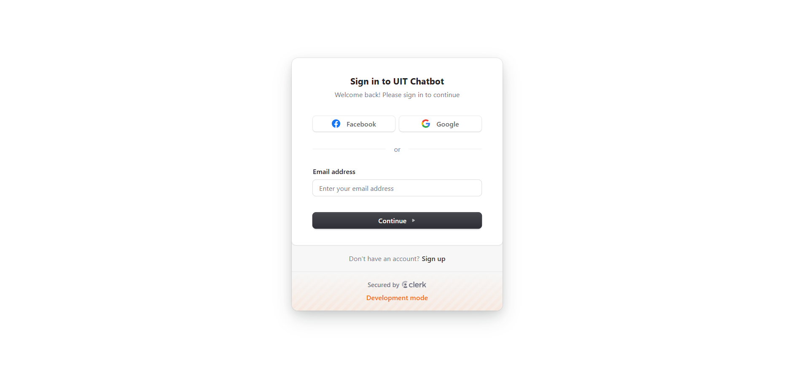
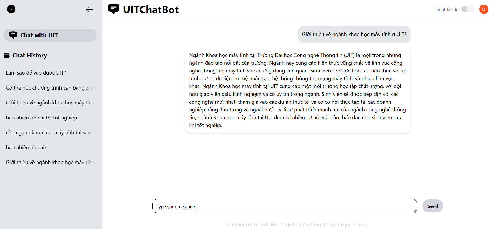

# 🤖 UIT Chatbot – Tư Vấn Tuyển Sinh Đại Học Công Nghệ Thông Tin (UIT)

UIT Chatbot là hệ thống hỏi đáp tự động được xây dựng nhằm hỗ trợ thí sinh và phụ huynh giải đáp các thắc mắc liên quan đến **tuyển sinh** của **Trường Đại học Công nghệ Thông tin – ĐHQG TP.HCM (UIT)**.

Hệ thống bao gồm:
- ✅ Giao diện web dễ sử dụng (frontend - sử dụng Next.js)
- ✅ Backend xử lý hội thoại với mô hình chatbot (FastAPI)
- ✅ Hệ thống nhúng câu hỏi, tìm kiếm ngữ nghĩa để phản hồi chính xác và nhanh chóng

---

## 🚀 Hướng dẫn sử dụng

### 1. Clone repository
```bash
git clone https://github.com/daoddp/UIT-Chatbot_fullversion.git
cd uit-chatbot
```
### 2. Cài đặt thư viện cần thiết
#### Backend (FastAPI)
```bash
cd chatbot_retrieve
pip install -r requirements.txt
```
#### Frontend (Next.js)
```bash
cd ../chatbot_frontend
npm install
```
### 3. Thiết lập biến môi trường
Tạo file `.env` trong thư mục `chatbot_frontend/` với nội dung như sau:
```bash
OPENAI_API_KEY="YOUR_OPENAI_API_KEY"
LANGCHAIN_API_KEY="YOUR_LANGCHAIN_API_KEY"
DATABASE_URL="YOUR_MONGODB_URL"
NEXT_PUBLIC_CLERK_PUBLISHABLE_KEY="YOUR_CLERK_KEY"
CLERK_SECRET_KEY="YOUR_CLERK_SECRET_KEY"
```
#### ⚠️ Lưu ý:
- Bạn cần có tài khoản MongoDB Atlas và đã tạo 1 cluster cùng database.
- Bạn cần tạo API_KEY từ OPENAI (có thể tự phát triển LLM khác như Gemini,... để tối ưu chi phí).

### 4. Chạy giao diện người dùng (frontend)
```bash
cd chatbot_frontend
npm run dev
```
Ứng dụng sẽ chạy tại: http://localhost:3000
### 5. Chạy server xử lý chatbot (backend)
```bash
cd ../chatbot_retrieve
uvicorn main:app --host 0.0.0.0 --port 8000 --reload
```
Docs API sẽ có tại: http://localhost:8000/docs

# 🌐 Một số ảnh giao diện
### 🧑‍💼 Giao diện đăng nhập

### 💬 Giao diện chatbot

